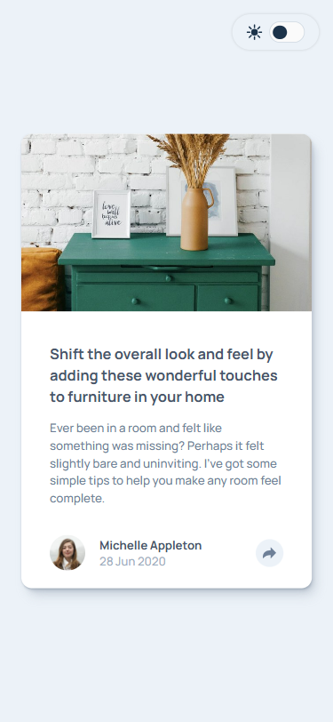
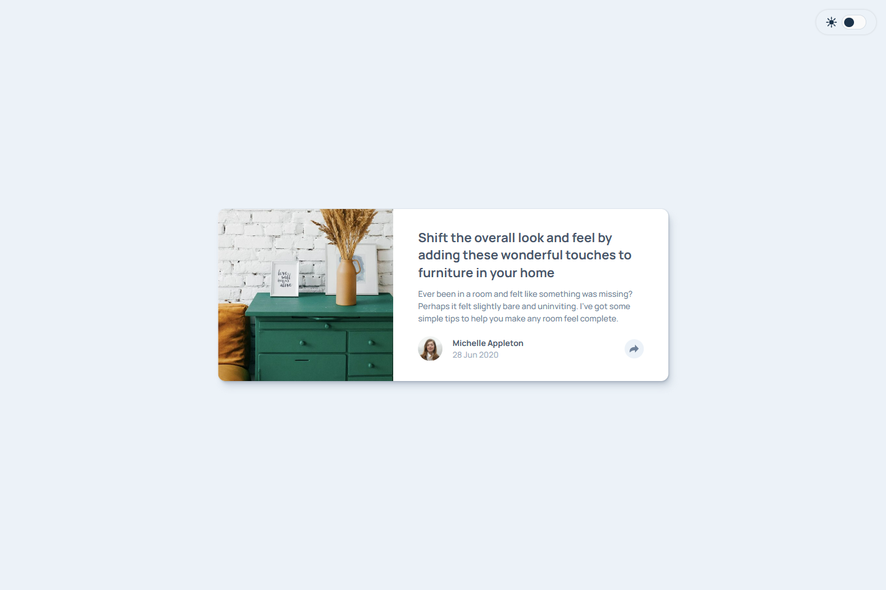
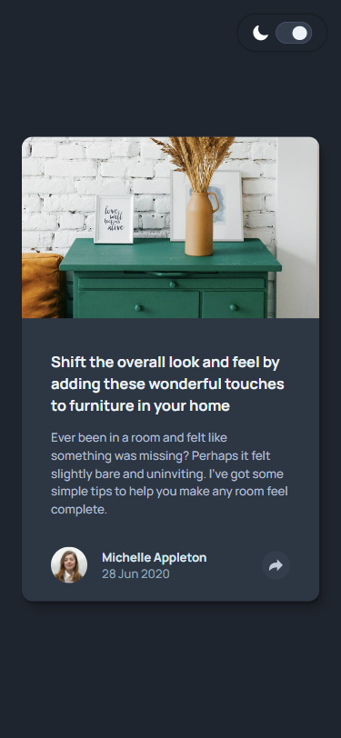
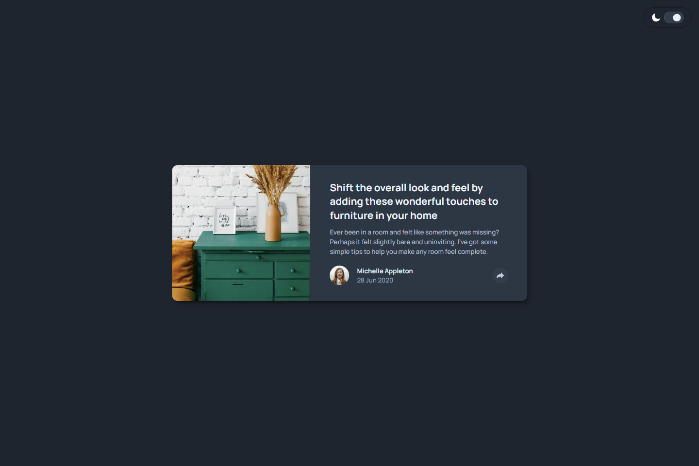

# 💻 Article Preview Component

## ℹ️ A Interactive and Responsive Shareable Article Preview From a Fictional Author

| _Mobile Preview (375x812)_                                   | _Desktop Preview (1440x960)_                                    |
| ------------------------------------------------------------ | --------------------------------------------------------------- |
|       |       |
|  |  |

This project is a fully interactive article preview where users can share said article via Facebook, Twitter, or Pinterest, toggle between light and dark mode, and experience a responsive, accessible design across all screen sizes.

Created as part of the building challenges from [Frontend Mentor](https://www.frontendmentor.io/).

---

## 🔍 Overview

The component is built with **semantic HTML5**, **modern CSS**, and **vanilla JavaScript modules** to handle dynamic behavior.

The main focus was creating an accessible and mobile-first layout with theme toggling and working social share links while also respecting user preferences.

---

## ✨ Features

- Responsive layout (mobile-first, scales up to desktop).
- Light/dark theme toggle
- Share to **Facebook**, **Twitter**, and **Pinterest** with pre-filled content
- Made sure site still works in `prefers-reduced-motion`
- Accessible interactive elements which uses ARIA attributes (`aria-expanded`, `aria-label`, `aria-hidden`)
- Added a simple keyboard support (`Escape` key closes share links if opened)
- Pixel-perfect implementation with [PerfectPixel](https://chrome.google.com/webstore/detail/perfectpixel-by-welldonecod/dkaagdgjmgdmbnecmcefdhjekcoceebi)

---

## 🧠 What I Learned

- I learned how to utlize more ARIA attributes in HTML5 for better accessibility
- First time learning that I can't normally target `::after` elements with JavaScript
- Using `matchMedia` for **reduced motion** checks
- Gained more experience in managing component state with ARIA attributes
- Getting more comfortable in writing modular JavaScript (`import/export`) for cleaner code separation.
- How to generate social share links dynamically for multiple platforms using `encodeURIComponent()` in JavaScript.

---

## 🛠️ Tech Used

- HTML5
- CSS3
- JavaScript
- Git
- GitHub
- Netlify

---

## 🎨 Design Reference & Tools

- JPG design image
- PerfectPixel

---

## 🚀 How to Run

1. Clone the repository
2. Open `index.html` in your browser

---

## 🌐 Live Demo

Or you can check out the 👉 [live website here](LINK)

---

## 📊 Performance Report

A **Google Lighthouse** audit was conducted on the final version of this project. You can view the full report [here](./assets/downloads/lighthouse-performance-report.pdf).

---

## 🧑‍💻 Author

Created by **Elmar Chavez**

🗓️ Month/Year: **August 2025**

📚 Journey: **5th** month of learning _frontend web development_.

<!--

FRONTEND MENTOR TAGS:
html css javascript vscode git github netlify 5th-month frontend-mentor project perfectpixel lighthouse theme-toggle

-->
